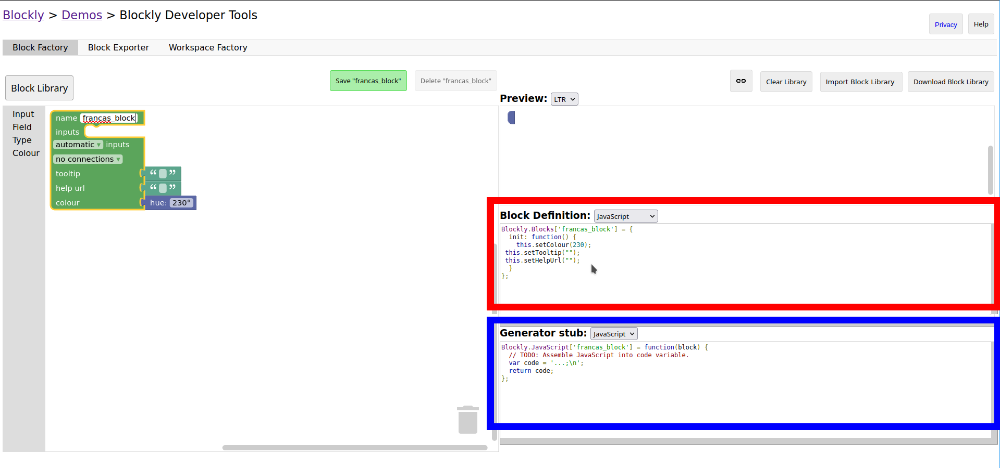

# Personnalisation du projet BlocklyPi

Ce guide permet de définir la procédure pour personnaliser ce fork du projet BlocklyPi, à savoir ajouter des blocs, des
boîtes à outils et permettre à ces composants d'intéragir avec le port GPIO de la Raspberry Pi. Ces instructions sont
spécifiques au projet actuel et servent de mémo pour faciliter sa personnalisation, dans le cadre des missions réalisées
par les Francas de Seine-Maritime.

À titre d'exemple, Une catégorie nommée `francas_category` a été ajoutée à la boîte à outils, ainsi qu'un bloc nommé
`francas_block`. Ils servent de modèle pour la création de nouveaux blocs et devraient être supprimés pour la mise en
production.

Si vous êtes débutant avec ce projet, lisez le guide de [Blockly](https://developers.google.com/blockly/guides/overview)
pour avoir un guide faisant le tour des principaux concepts. Les notions de programmation en bloc, toolbox, workpace ou
autres demandent à être comprises pour suivre ce guide, et ne seront pas redéfinies ici.

## Ajout d'une nouvelle catégorie à la boîte à outils

La boîte à outils par défaut utilisée par le projet est dans le fichier
[index.html](index.html). Chaque nouvelle catégorie doit être placée dans ce fichier, dans la balise `<xml>`.

Une catégorie a la syntaxe suivante :

 ```xml

<category name="francas_category" colour="#ff8000">
    <block type="francas_block1"></block>
    <block type="francas_block2"></block>
    <!---etc.-->
</category>
 ```

## Création d'un bloc

Le code décrivant un bloc a 3 composantes :

- La déclaration du bloc dans la boîte à outils : Elle permet de rendre visible le bloc dans la catégorie de son choix.
- La déclaration de l'interface utilisateur du bloc : L'apparence et toutes les possibilités d'interaction de
  l'utilisateur avec le bloc :
    - Sa couleur.
    - Ses éléments descriptifs (textes, images, etc).
    - Ses paramètres (entrées de valeurs, déclarations d'autres blocs, etc).
- Le générateur de code associé au bloc : Le composant chargé de traduire l'interface du bloc en code exécutable par la
  Raspberry Pi, en prenant en compte les paramètres de l'utilisateur.

### Création de l'interface du bloc

Pour faciliter l'écriture du code définissant le comportement de notre bloc, nous pouvons utiliser
l'outil [Blockly Factory](https://blockly-demo.appspot.com/static/demos/blockfactory/index.html).


Exemple de déclaration de bloc :

```js
Blockly.Blocks['francas_block'] = {
    init: function () {
        this.appendDummyInput()
            .setAlign(Blockly.ALIGN_CENTRE)
            .appendField("Francas Bloc")
            .appendField(
                new Blockly.FieldImage("https://www.bafa-lesfrancas.fr/sites/default/files/2017-08/logo-francas_0.png",
                    100, 50, {alt: "*", flipRtl: "FALSE"}));
        this.appendDummyInput()
            .appendField("Un bloc pour faire des tests");
        this.appendDummyInput()
            .appendField("Faire clignoter la led de la carte ")
            .appendField(new Blockly.FieldTextInput("3"), "nbBlinks")
            .appendField(" fois.");
        this.setPreviousStatement(true, null);
        this.setNextStatement(true, null);
        this.setColour(30);
        this.setTooltip("");
        this.setHelpUrl("");
    }
};
```

### Ajout du bloc au projet

Une fois le bloc créé, différents morceaux de code sont à insérer dans le projet de la manière suivante :

- Le code dans la zone en **rouge**, celui de définition du bloc, doit être mis dans le fichier
  [`blockly/blocks`](blockly/blocks).
- Le code dans la zone en **bleu**, celui qui génère le code à envoyer à la Raspberry Pi en fonction des paramètres du
  bloc, doit être mis dans le fichier
  [`blockly/generators/javascript`](blockly/generators/javascript).
- La ligne `<block type="francas_block1"></block>` doit être ajoutée dans le fichier
  [`index.html`](index.html), au sein de la catégorie voulue.

Il est bienvenu de rassembler le code des blocs d'une même catégorie au sein d'un même fichier. Par exemple, pour tous
les blocs de la catégorie `Francas`, on aurait la configuration suivante :

- Le code de définition de bloc dans le fichier [`blockly/blocks/francas.js`](blockly/blocks/francas.js).
- Le code générateur dans le
  fichier [`blockly/generators/javascript/francas.js`](blockly/generators/javascript/francas.js).

Ne pas oublier de faire appel à ces fichiers, en ajoutant

- `<script src="blockly/blocks/francas.js"></script>`
- `<script src="blockly/generators/javascript/francas.js"></script>`

dans la balise `<head>` de [`index.html`](index.html)

### Personnalisation du générateur de code

Le générateur de code est une fonction qui retourne une variable de type `String` dont le contenu est le code écrit en
***, à destination du GPIO de la Raspberry Pi.

Exemple de code générateur :

```js
Blockly.JavaScript['francas_block'] = function (block) {
    var code = ''; // instructions à venir...
    return code
}
```

Se référer au guide de Blockly donné au début du document pour avoir toutes les informations sur la façon de récupérer
les valeurs des arguments renségnés par l'utilisateur.
